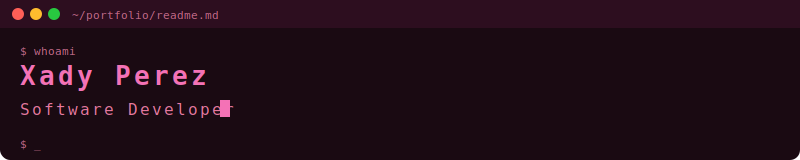

<div align="center">
  
</div>

<div align="center">


</div>

---

## ✨ About Me

```bash
$ cat about.txt
```

> 🌷 Apasionada por crear interfaces web modernas e intuitivas
>
> 💻 Enfocada en **Frontend Development** con Angular
>
> 🎨 Interesada en UI/UX design y experiencias responsivas
>
> 🚀 Construyendo proyectos y expandiendo mi portfolio

---

## 🌸 Current Focus


---

## 📊 GitHub Stats

<div align="center">
  
  
</div>

<div align="center">
  
</div>

---

## 📈 Contribution Activity

<div align="center">
  
</div>

---

## 💌 Contact

<div align="center">

[](https://github.com/pxadanny)
[](mailto:pxadanny@gmail.com)

</div>

---

<div align="center">
  
</div>

<div align="center">

```
$ echo "Thanks for visiting! 🌷"
```

</div>
